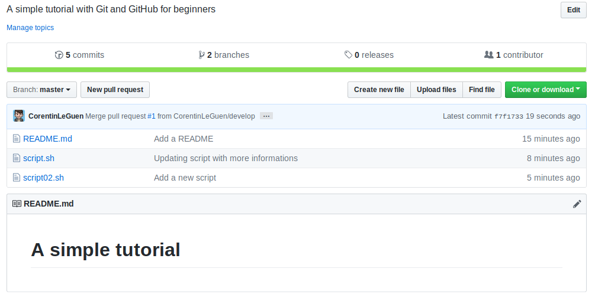
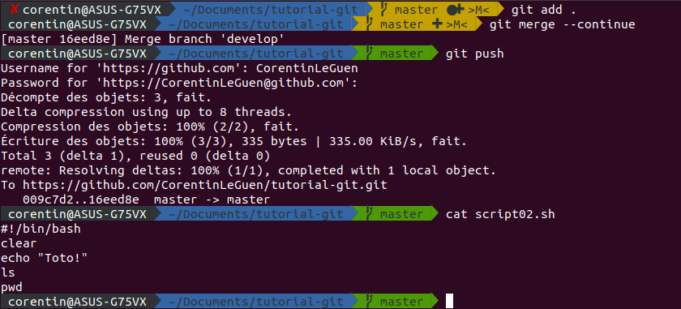

# A simple tutorial

How to create a repository in GitHub and publish stuff ?

You can read the official documentation [here](https://git-scm.com/doc). And if you are on Windows, you can use this useful software : [GitForWindows](https://gitforwindows.org/).


## Create a repository in GitHub


Enter a name for your repository and a description :


You can see the URL to access your repository :


Push this button to copy in clipboard the URL automaticaly :


## Create a project in your computer

Create a repository in your computer and use ```git init .``` to initialize the project :


## Synchonize

Past the copied link to your git project to synchronize the distant GitHub repository with your local git repository :


## Add work

Add a new file and commit your work :


You should create the distant branch *master* with :


The command ```git push -u <remote> <branch>``` is used to create a distant branch who didnt exist yet.

And you can see your work in GitHub ! **Congratulation!**


Let's add another stuff !


You can use ```git status``` to see what's new in your computer :


And push your job :


Use `git log` to see all commits :


## Create a new "branch"

A new branch is used to work with multiple coworkers or to "clean" the job. It's easier to see the "feature" of a coworker when he work on his own branch who's named "feature/fix-api-security" for example. And you will not realise simultaneous pushes that can destroy the git repository and result to a chaotic project.


Don't forget to ```push``` the local branch to create the distant branch with :


Then update or create new stuff :


When you have updated something, you can use ```git diff``` to see what have been modified :


And push your work :


## Amend a commit

When you have modified a file and you want to update it one more time without creating a new commit, you can use this command :


Make the fix and :


Don't forget to use `git push --force` after a commit.\
:warning: **Never use `amend` on a merge commit!**

## Merge

### In command line

To merge two branches, you can use `git merge <branch-name>` :


### Directly on GitHub

This method is used when you work on team and you need to submit your job.


Go to GitHub :


Use "Compare & pull request" to submit your work :


Add a commit name, a description. You can see on the bottom of the page the differences between the current branch (here *master*) and the submited branch.


Then push "Create pull request" and GitHub will check if you have some conflicts before merging the branches :


And then you will see :




## Conflicts

When someone push stuff on branch "A" and someone else push stuff on the same file on branch "B" and then branches are pull requested, you can see a merge conflict like this :

On branch master :


On branch develop :


And then merge on master :


Just use `git diff` to show where is the conflict and choose your modifications :


After remove the "======" and choose the apropriate modifications, you can use `git add` and `git merge --continue` to update the work :



This simple tutorial is over, **congratulation**!

If you are reluctant to use the command line git, there is some softwares like [Sourcetree](https://www.sourcetreeapp.com/) or [GitKraken](https://www.gitkraken.com/). But I think there is nothing better than the good old command line !

For more informations, you can contact me on *leguen.corentin42@gmail.com*.